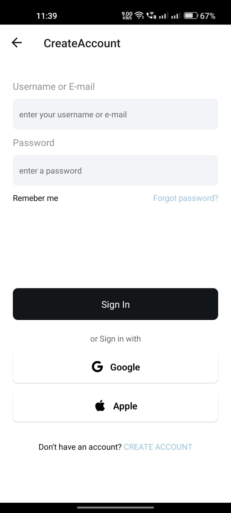
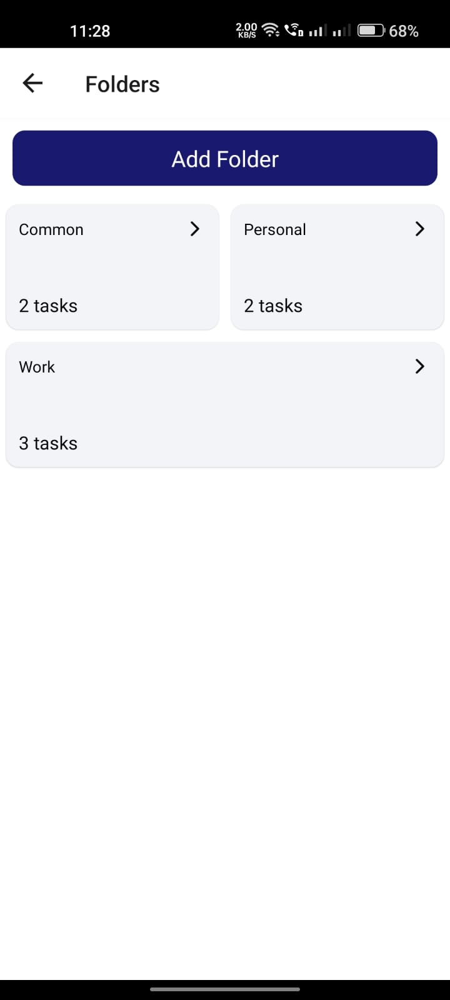

# TODO App

A modern todo app built using react native. 
### Features
1. Authentication
2. Creater Folders
3. Edit / Delete Folder
3. Create tasks
4. Edit Tasks
5. Delete Task
6. Edit profile

## ScreenShots

1. Onboarding Screen

2. Login Screen 

3. Home Screen

4. Tasks Screen

5. Folders Screen
